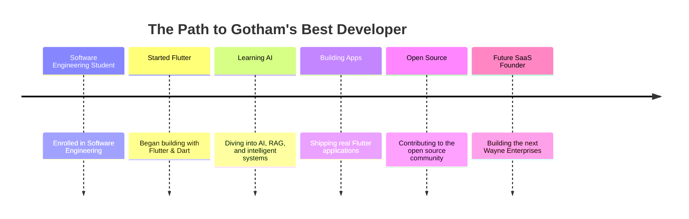

<div align="center">


<a href="https://github.com/hamza2348">
  
</a>


</div>

<br>

## 🦇 MISSION FILE — CLASSIFIED

<table align="center">
<tr>
<td>

```yaml
Alias:        Hamza Sattar
Codename:     hamza2348
Status:       Active — Flutter Developer
Mission:      Build beautiful, production-grade Flutter applications
Location:     Pakistan 🇵🇰
Current Training:
  - Flutter & Dart
  - Firebase
  - AI / RAG Systems
  - Backend Engineering
  - UI / UX Design
  - Software Engineering (Student)
Clearance:    Wayne Enterprises — R&D Division
```

</td>
</tr>
</table>

<div align="center">


</div>

## 🛠️ THE TECH ARSENAL

<div align="center">


</div>

<div align="center">

| 🦇 Gadget | 🦇 Gadget | 🦇 Gadget |
|:---:|:---:|:---:|
| Flutter | Dart | Firebase |
| Java | Python | REST API |
| Git & GitHub | MySQL | Android Studio |
| VS Code | Figma | — |

</div>

<div align="center">


</div>

## 📡 GITHUB INTELLIGENCE — BATCOMPUTER FEED

<div align="center">


</div>

### 🕸️ Contribution Web

<div align="center">


</div>

### 🐍 The Bat-Snake (contribution snake animation)

<div align="center">


</div>

> ⚠️ To activate the snake above, add the included `snake.yml` workflow to your **`hamza2348/hamza2348`** repo under `.github/workflows/`. GitHub Actions will generate the animated SVG automatically after the first run.

<div align="center">


</div>

## 🏆 ACHIEVEMENTS

<div align="center">


</div>

<div align="center">


</div>

## 💼 FEATURED CASE FILES

<table align="center" width="100%">
<tr>
<td width="50%" valign="top">

### 🗳️ [Voting System](https://github.com/hamza2348/onlinevotingsystem)
**Case #001 — Online Voting Platform**

A secure digital voting system built for transparent, tamper-resistant elections.

`Java`

[](https://github.com/hamza2348/onlinevotingsystem)

</td>
<td width="50%" valign="top">

### 🌐 [Portfolio](https://github.com/hamza2348/porfolio)
**Case #002 — Personal Portfolio Site**

Hamza's personal developer portfolio, showcasing projects and skills.

`TypeScript`

[](https://github.com/hamza2348/porfolio)

</td>
</tr>
<tr>
<td width="50%" valign="top">

### 📄 [CV](https://github.com/hamza2348/cv)
**Case #003 — Digital Resume**

A clean, structured repository housing Hamza's professional CV.

[](https://github.com/hamza2348/cv)

</td>
<td width="50%" valign="top">

### 🧠 [DevSphere](https://github.com/hamza2348/devsphere)
**Case #004 — Developer Project Space**

Active build in progress — part of Hamza's ongoing developer training ground.

[](https://github.com/hamza2348/devsphere)

</td>
</tr>
</table>

<div align="center">


</div>

## 🕰️ MISSION TIMELINE



<div align="center">


</div>

## ☎️ SIGNAL THE BAT

<div align="center">

[](https://github.com/hamza2348)
[](#)
[](#)
[](https://github.com/hamza2348/porfolio)
[](#)

</div>

<div align="center">


</div>
