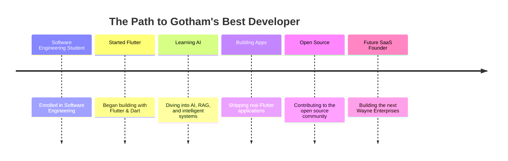

<div align="center">


<br>

[](https://github.com/hamza2348)
[](https://github.com/hamza2348?tab=followers)
[](https://github.com/hamza2348?tab=repositories)

</div>


<br>

<div align="center">

```ansi
[BATCOMPUTER]$ ./initiate_scan.sh --target=hamza2348

> Establishing secure uplink to Wayne Enterprises R&D ......... [ OK ]
> Decrypting developer credentials ............................ [ OK ]
> Loading Flutter / Dart runtime ............................... [ OK ]
> Mounting AI / RAG research modules ........................... [ OK ]
> Cross-referencing GitHub activity ledger ..................... [ OK ]
> Status: ACTIVE FIELD AGENT — GOTHAM SOFTWARE DIVISION

ACCESS GRANTED.
```

</div>

<br>

## 🦇&nbsp; MISSION FILE — CLASSIFIED

<table width="100%">
<tr>
<td width="55%" valign="top">

```yaml
Alias:            Hamza Sattar
Codename:         hamza2348
Status:           ● Active — Flutter Developer
Base of Ops:      Pakistan 🇵🇰
Clearance:        Wayne Enterprises — R&D Division

Primary Mission:
  Build beautiful, production-grade
  Flutter applications.

In Training:
  ├─ Flutter & Dart
  ├─ Firebase
  ├─ AI / RAG Systems
  ├─ Backend Engineering
  ├─ UI / UX Design
  └─ Software Engineering (student)
```

</td>
<td width="45%" valign="top">

### 📁 Field Notes

> *"It's not who I am underneath,*
> *but what I do that defines me."*

**Focus this quarter**
Shipping AI-assisted mobile apps and sharpening backend fundamentals — moving from student projects toward production-grade, open-source work.

**Open to**
Collaboration on Flutter + AI projects, freelance builds, and open-source contributions.

</td>
</tr>
</table>


## 🛠️&nbsp; THE TECH ARSENAL

<div align="center">


<br><br>

`Flutter` `Dart` `Firebase` `Java` `Python` `REST API` `MySQL` `Git & GitHub` `Android Studio` `VS Code` `Figma`

</div>


## 📡&nbsp; BATCOMPUTER FEED — LIVE INTEL

<div align="center">
<table>
<tr>
<td width="50%">

</td>
<td width="50%">

</td>
</tr>
</table>


</div>

### 🕸️&nbsp; Contribution Web

<div align="center">

</div>

### 🐍&nbsp; The Bat-Snake

<div align="center">

</div>


## 🏆&nbsp; ACHIEVEMENTS

<div align="center">

</div>


## 💼&nbsp; FEATURED CASE FILES

<table width="100%">
<tr>
<td width="50%" valign="top">

<h3>🗳️ <a href="https://github.com/hamza2348/onlinevotingsystem">Voting System</a></h3>
<sub>CASE #001 — SECURE ELECTIONS PLATFORM</sub>

A secure digital voting system built for transparent, tamper-resistant elections.


[](https://github.com/hamza2348/onlinevotingsystem)

</td>
<td width="50%" valign="top">

<h3>🌐 <a href="https://github.com/hamza2348/porfolio">Portfolio</a></h3>
<sub>CASE #002 — PERSONAL DEV SHOWCASE</sub>

Hamza's personal developer portfolio, showcasing projects and skills.


[](https://github.com/hamza2348/porfolio)

</td>
</tr>
<tr>
<td width="50%" valign="top">

<h3>📄 <a href="https://github.com/hamza2348/cv">Digital Resume</a></h3>
<sub>CASE #003 — CREDENTIALS ARCHIVE</sub>

A clean, structured repository housing Hamza's professional CV.

[](https://github.com/hamza2348/cv)

</td>
<td width="50%" valign="top">

<h3>🧠 <a href="https://github.com/hamza2348/devsphere">DevSphere</a></h3>
<sub>CASE #004 — ACTIVE R&D BUILD</sub>

Ongoing developer training ground — active build in progress.

[](https://github.com/hamza2348/devsphere)

</td>
</tr>
</table>


## 🕰️&nbsp; MISSION TIMELINE




## ☎️&nbsp; SIGNAL THE BAT

<div align="center">

[](https://github.com/hamza2348)
[](#)
[](#)
[](https://github.com/hamza2348/porfolio)
[](#)

</div>


